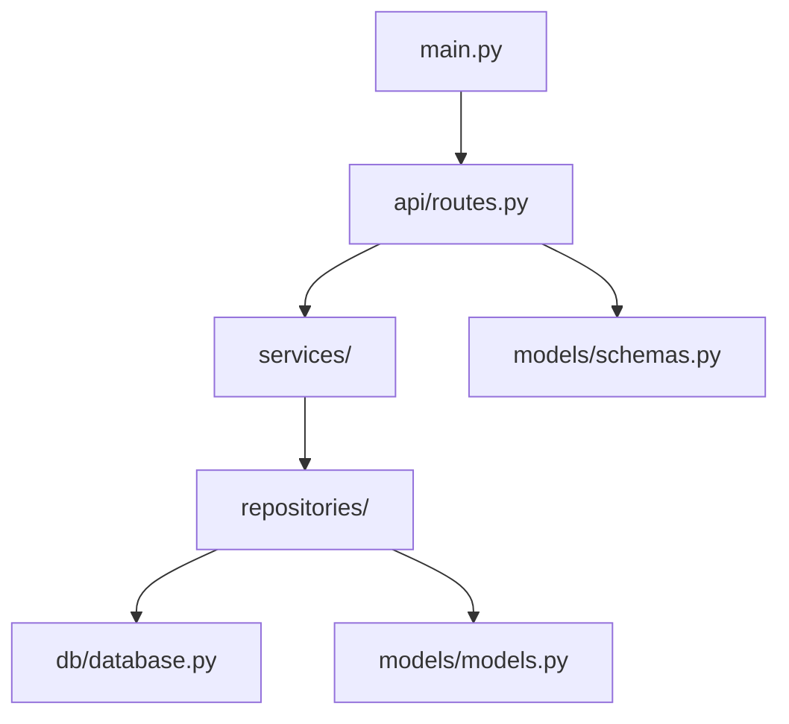

# Event Management System API

A production-ready FastAPI backend for managing events and attendees, built with clean architecture, async support, and robust validation.

## Features
- Create, list, and delete events
- Register and list attendees
- Pagination for event listing
- Timezone conversion (UTC/IST)
- Validation and error handling
- Async database access (SQLite)
- Full test coverage with pytest

## Tech Stack
- FastAPI
- SQLAlchemy (async)
- databases[sqlite]
- Pydantic v2
- Alembic (migrations)
- pytest, pytest-asyncio, httpx, pytest-cov
- pytz

## Setup & Installation
## API Documentation
Once the server is running, you can view and interact with the API docs at:
- Swagger UI: [http://127.0.0.1:8000/docs](http://127.0.0.1:8000/docs)
- ReDoc: [http://127.0.0.1:8000/redoc](http://127.0.0.1:8000/redoc)
1. **Clone the repository**
   ```bash
   git clone <your-repo-url>
   cd assesment
   ```
2. **Install dependencies** (from requirements.txt):
   ```bash
   pip install -r requirements.txt
   ```
3. **Run database migrations** (if using Alembic):
   ```bash
   alembic upgrade head
   ```
4. **Start the FastAPI server**:
   ```bash
   uvicorn app.main:app --reload
   ```
   The API will be available at http://127.0.0.1:8000

## How to Run Test Cases
Run all tests using pytest:
```bash
pytest
```

## How to Check Code Coverage
Run tests with coverage report:
```bash
pytest --cov=app --cov-report=term-missing
```
This will show which lines are covered and which are missing.


## Example Test Cases
- Event creation (valid/invalid)
- Attendee registration (success, duplicate, event full, invalid email, missing fields)
- Event listing and pagination
- Attendee listing
- Event deletion
- Error scenarios (non-existent event, invalid dates, past dates)

## Project Structure


## API Endpoints & Schemas
- `POST /events` - Create a new event
- `GET /events` - List upcoming events (supports pagination)
- `GET /events/{event_id}` - Get event details
- `DELETE /events/{event_id}` - Delete an event
- `POST /events/{event_id}/register` - Register an attendee
- `GET /events/{event_id}/attendees` - List attendees for an event

### Example Schemas

#### EventCreate (request)
```json
{
   "name": "Sample Event",
   "location": "Conference Hall",
   "start_time": "2025-08-29T12:00:00+05:30",
   "end_time": "2025-08-29T14:00:00+05:30",
   "max_capacity": 100
}
```

#### EventOut (response)
```json
{
   "id": 1,
   "name": "Sample Event",
   "location": "Conference Hall",
   "start_time": "2025-08-29T06:30:00+00:00",  // UTC
   "end_time": "2025-08-29T08:30:00+00:00",    // UTC
   "max_capacity": 100,
   "start_time_formatted": "2025-08-29 12:00:00 IST",
   "end_time_formatted": "2025-08-29 14:00:00 IST"
}
```

#### AttendeeCreate (request)
```json
{
   "name": "John Doe",
   "email": "john@example.com"
}
```

#### AttendeeOut (response)
```json
{
   "id": 1,
   "event_id": 1,
   "name": "John Doe",
   "email": "john@example.com"
}
```

## Testing & Coverage
- Run tests:
  ```bash
  pytest
  ```
- Check coverage:
  ```bash
  pytest --cov=app --cov-report=term-missing
  ```

## Project Structure

## Structural Diagram



## Project Structure
```
app/
   api/routes.py         # API endpoints
   db/database.py        # Database setup
   main.py               # FastAPI app
   models/models.py      # SQLAlchemy models
   models/schemas.py     # Pydantic schemas
   repositories/         # Data access layer
   services/             # Business logic
requirements.txt        # Dependencies
```

## Notes
- All datetime fields are stored in UTC and converted to IST for output.
- Validation errors and business logic errors return clear messages and appropriate HTTP status codes.


